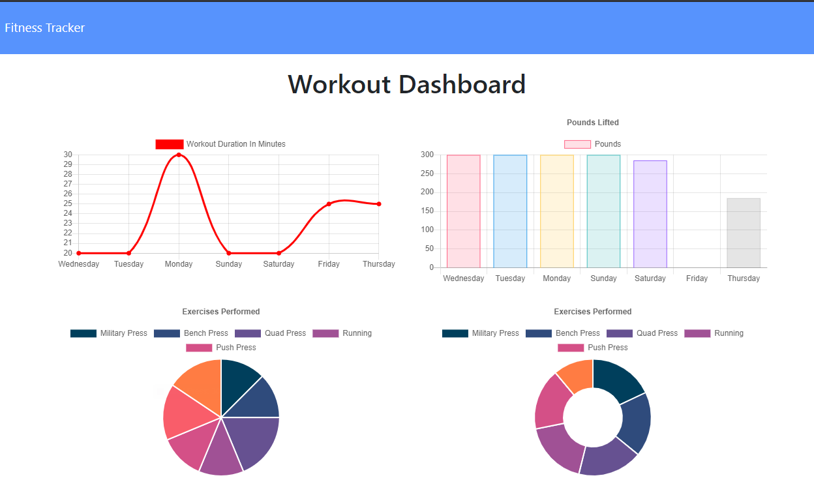

# Fitness Tracker
Project for UC Berkeley coding Bootcamp

[](https://opensource.org/licenses/MIT)



## Technologies Used
- HTML
- CSS
- JavaScript
- [Node.js](https://nodejs.org/en/)
- [npm](https://www.npmjs.com/) packages
    - [express](https://www.npmjs.com/package/express)
    - [mongoose](https://mongoosejs.com/)
- [HEROKU](https://www.heroku.com/)

## Summary 
This fitness tracker App allows you to keep a detailed track of your workouts, then render weekly graphics of your progess and average data.

## How to install
```
node install
```


## How to use it
!You Need to have MongoDB installed!

run the commande 

```
node seeders/seed.js
```
then

```
npm start then browse http://localhost:3000
```

## Code Snippet  
```Javascript 
    db.Workout.aggregate([{
        $addFields: {
            totalDuration: {
                $sum: "$exercises.duration"
            }
        }
    }]).sort({ day: -1 })
        .limit(7)
        .then(workout => {
            res.json(workout)
        })
        .catch(err => {
            res.json(err);
        })
```
The Mongoose aggregate method allow us to pull data from multiple rows and group it's data.

## Deployed Link

[See Live Site](https://fitness-tracker-dc.herokuapp.com/)


## Author Links
[LinkedIn](https://www.linkedin.com/in/dcouzon/)
[GitHub](https://github.com/Dylancouzon)
